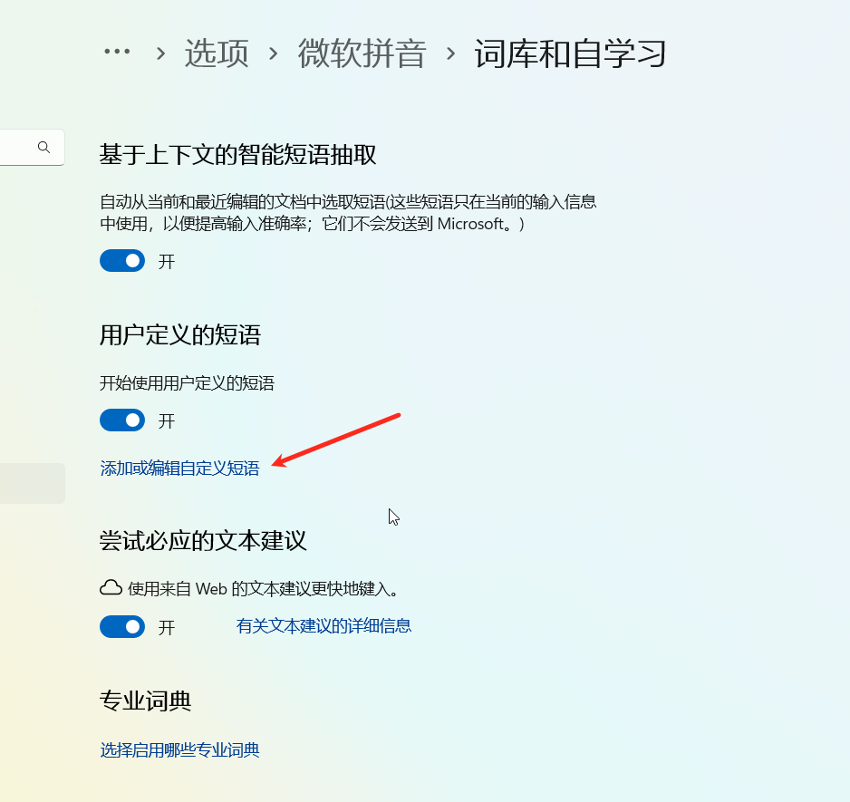

# 输入法自定义短语转换工具 📝

  

一款用于在不同输入法之间转换自定义短语的实用工具，支持百度、搜狗、手心输入法以及微软自定义短语的转换，帮助用户高效迁移和管理输入法短语库。

  

## 功能特性 ✨

  

- **百度/手心 转至 搜狗**：轻松迁移百度或手心输入法的自定义短语到搜狗输入法。

- **搜狗 转至 百度/手心**：将搜狗输入法的自定义短语转换为百度或手心输入法格式。

- **百度转至微软自定义短语**：将百度输入法的短语转换为微软自定义短语的 `.dat` 格式。

  

## 使用方法 🛠️

 只需要注意文件编码即可。

## 缺陷

1. 手心转微软的txt是utf8编码，其余情况均为utf16le。
ps：不知道为什么，我更换成utf16之后，转成微软自定义短语dat会丢失一些数据，目前不详，后续考虑全部转换成utf8算了。
  

## 其他说明 📝

  

- **变量文件**：由于百度和搜狗输入法之间的变量存在差异（如日期、时间等变量的表示不一样），项目中提供了动态变量对照表 `var.csv`。

- **微软自定义短语导入方式**：

    - 设置 ⇒ 语言和区域 ⇒ 时间和语言 ⇒ 选项 ⇒ 键盘选项 ⇒ 微软拼音 ⇒ 词库和自学习 ⇒ 添加或编辑自定义短语，导入 `.dat` 文件。

    - 如果需要删除导入的自定义短语，可直接删除 `%APPDATA%\Microsoft\InputMethod\Chs\ChsPinyinEUDPv1.lex` 文件。

# 注意事项

  

文中的各个文件均使用utf-16-le编码格式，如果你的文件不是该编码，可以采用记事本、notepad++、vscode等编辑器打开重新选择该编码进行保存即可。

例外：var中的对照表采用的utf8编码。

  

## 贡献指南 🤝
感谢：[输入法词库解析（七）微软用户自定义短语.dat - nopdan's blog](https://nopdan.com/2022/09/07-msudp-dat/)
  

欢迎提出问题和建议！如果您有新的功能想法或优化建议，请随时提交 Issue 或 Pull Request。

  

## 许可证 📜

  

本项目采用 MIT 许可证，详情请查看 LICENSE 文件。

  

## 联系信息 📬

  

如有任何问题或建议，欢迎通过 [邮箱地址](mailto:tianzhongstz@gmail.com) 联系我。

  

---

  

希望这份 README 文档能够帮助用户更好地了解和使用您的工具！